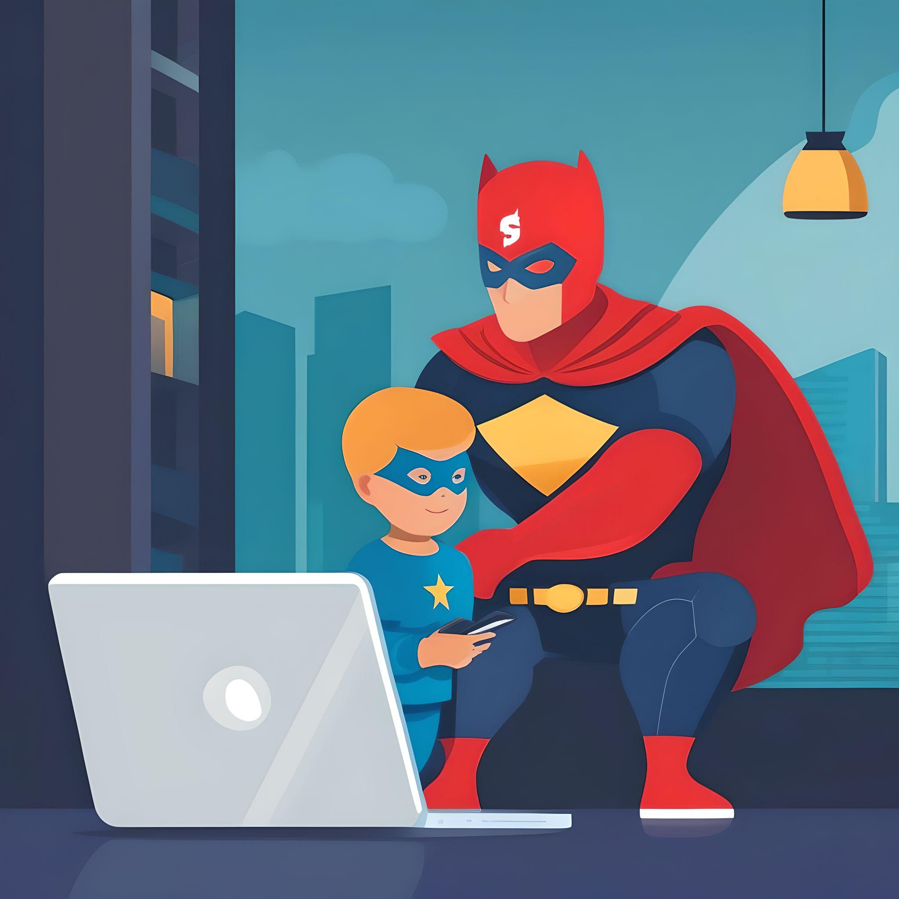

# Pasarelas de pago
Las _**pasarelas de pago**_ actúan como superhéroes 🦸‍♂️, ¡haciendo que las compras online sean fáciles y seguras! 🥳 Imagina que quieres comprar un juego por Internet 🎮. Estos superhéroes entran en acción, ocultando tu información de pago de cualquier _mirada indiscreta_ 🏴‍☠️ en la web 🌐, ya que esta información es como una poderosa joya y debe ser protegida. Una vez que todo está seguro, estos guardianes trasladan el dinero desde el lugar donde lo guardas hasta la tienda donde has comprado el juego, ¡casi como por arte de magia! Este proceso sin complicaciones permite a las personas de todo el mundo realizar compras a través de sus teléfonos 📱, computadores 💻 y más, todo sin salir de la comodidad de sus casas 🏠.

Antes de que aparecieran las _**pasarelas de pago**_, comprar cosas por Internet era realmente complicado :tired_face:. Si querías comprar algo de otro país, tenías que viajar hasta allí, lo que encarecía todo :moneybag:. Pero ahora, gracias a estos superhéroes, es como si todo el mundo estuviera conectado por un camino mágico especial, lo que hace que comprar cosas sea más rápido y fácil que nunca. Así que ahora, estés donde estés, ¡comprar cosas por Internet es como tener un superpoder!

